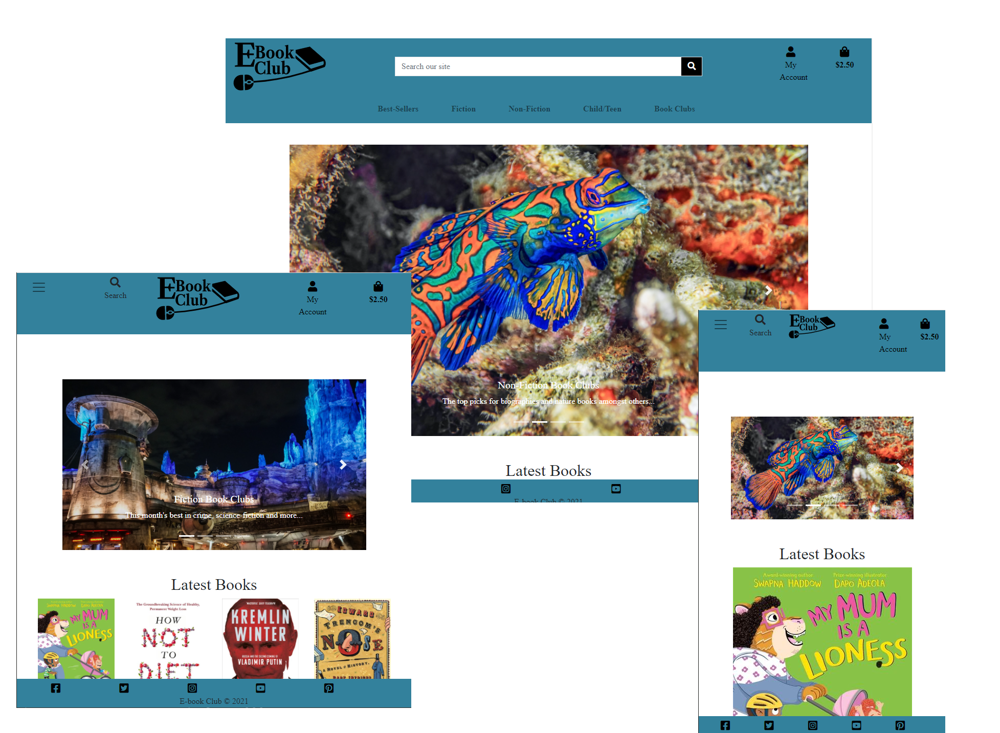

# **E-book Club**

[View the live project here](https://e-book-club.herokuapp.com/)  
This is the documentation for the E-Book Club e-commerce project. E-Book Club is an online seller of the latest books in pdf format at reasonable prices. Users may purchase these books as one of purchases. They may also subscribe to the many different genres of book clubs on the site to receive money of the top book picks every month. The more subscriptions that the users have the cheaper each individual subscription costs. The primary goals of the website are to provide many different book titles to users at affordable prices, to cater for those interested in all kinds of books as well as to share the expertise of the site owners by curating book clubs each month for the site users.
## **Table of Contents**
*  **[Technologies Used](#technologies-used)**
    * [Code](#code)
    * [Languages](#languages)
    * [Frameworks and Libraries](#frameworks-and-libraries)
    * [Databases](#databases)
    * [Validators](#validators)
    * [Other Technologies Used](#other-technologies-used)
*  **[UX Design](#ux-design)**
    * [Strategy Plane](#strategy-plane)
        * [Value Provided to the Business](#value-provided-to-the-business)
        * [Value Provided to the Users](#value-provided-to-the-users)
        * [B2C Considerations](#b2c-considerations)
        * [Cultural Considerations](#cultural-considerations)
        * [Business Objectives](#business-objectives)
        * [User Needs](#user-needs)
        * [Opportunities Table](#opportunities-table)
    * [Scope Plane](#scope-plane)
        * [Site Features](#site-features)
        * [User Stories](#user-stories)
    * [Structure Plane](#structure-plane)
        * [Interaction Design](#interaction-design)
        * [Information Architecture](#information-architecture)
    * [Skeleton Plane](#skeleton-plane)
        * [Project Wireframes](#project-wireframes)
    * [Surface Plane](#surface-plane)
        * [Colour](#colour)
        * [Layout](#layout)
        * [Fonts](#fonts)
        * [Images](#images)
        * [Order and Sequence](#order-and-sequence)
        * [Identity](#identity)

## **Technologies Used**

## **UX Design**
### **Code**

* VSCode - to write the code for the project
* Git - used for version control 
* Github - software used to store project remotely

### **Languages**

* HTML
* CSS
* JavaScript
* Python

### **Validators**
 * [W3Schools HTML validator](https://validator.w3.org/) 
 * [W3Schools Jigsaw CSS validator](http://jigsaw.w3.org/css-validator/validator) 
 * [JSHint JavaScript validator](https://www.jshint.com/)  - The code was validated in using the jshint extension for vscode with the esversion set to esversion 6.

### **Frameworks and Libraries**

* fontawesome
* JQuery
* Google Fonts
* Django REST framwork

 ### **Other Technologies Used**

 * [Balsamiq](https://balsamiq.com/) - for creating wireframes
 * Chrome developer tools - for testing and inspecting code
 * Lighthouse - for testing performance rating of deployed site
 * [Boxy SVG Editor](https://boxy-svg.com) - for creating brand logo
 * [GIMP](https://www.gimp.org/) - for resizing images

[back to contents](#table-of-contents)

## **UX Design**
### **Strategy plane**

The strategy plane for the site was completed with consideration to the business objectives along with the user needs.

#### **Value Provided to the Business**

The main value of the site provided to the business is by allowing them to generate a profit. The profit is generated from users making individual purchases of e-books as well as subscribing themselves to the various genre of book-clubs on the site. It also allows them to develop a new brand and study the market for expansion at a future date. The site also allows users to review the books on the site. This gives the business feedback on the books they are choosing to put on the site and adjust depending whether the books are popular or not.

#### **Value Provided to the Users**

The site provides value to the users in several ways. The obvious value the site gives them is in the opportunity provided to purchase e-books at a reasonable price. Another main value provided by the site is its ability to aid the users in choosing which books to purchase and read. This is achieved in three main ways. Firstly, the site provides the users with rich descriptions of the books on the product pages. Secondly, the users can subscribe to book clubs in which the books of the month are provided for the various genres of books advertised on the site. Finally the site has a review section on the product pages which the users can read in order to help them in determine whether an individual book is worth reading or not.

#### **B2C Considerations**

Due to the site being used by a business to consumer business several considerations were made taking this into account. The images on the site are large. The content is minimal where possible and is designed to draw users in. The site navigation is designed to be intuitive and simple. The prices on the site are always visible to the user and the purhase buttons are large and eye-catching. This is in order to support impulse buying. The site uses strong branding. The branding of the site is ... . The above considerations keep the user in a good mood while using the site creating a positive experience. This is important as it keeps the users returning to the site. It also means that users would be more likely to recommend the site to their friends.

#### **Cultural Considerations**

The site is designed to be used by those who enjoy reading. This could possibly include older people. This means that it is important for the site to be as user-friendly as possibly. 

#### **Business Objectives**

When completing the strategy section of the UX design for the site the business outlined several objectives. The objectives are as follows:

* To curate and sell a collection of e-books
* To generate a profit
* To create book clubs for the various categories of books
* To create a strong site branding and positive user experience so that users would recommend the site to others
* To provide compelling reasons on the site for users to purchase the e-books
* To create a newsletter for site-users to subscribe to
* To offere discounts when users sign up to more than one book club 
* To create a blog where authors of books advertised on the site are interviewed
* To allow users to sign up for marketing emails
* To collect feedback for the books on the site in order to adjust to consumer demands
* To have an eye-catching landing page as well as an eye-catching site in general
* To provide links to the business' social media pages
* To give users information about the company philosophy
* To have their card/address information saved for ease of use

#### **User Needs**

When completing the strategy section of the UX design for the site, several user needs were identified. The needs are as follows:

* To register an account and login
* To purchase individual e-books 
* To download the books that they have paid for
* To read descriptions and information about the books on the site
* To read a write reviews for the books they wish to/have purchased
* To navigate around the site with ease
* To search for individual book titles
* To subscribe to the book clubs in order to receive the top books in any given category for the month
* To view and edit their basket
* To view current subscriptions and unsubscribe if desired
* To view the collection of books that they have paid for
* To read supplementary information relating to the books on the site such as a newsletter or blog
* To view the business' social media pages
* To understand the business philosophy

On reviewing the business goals and user needs, a table of opportunities was created and their importance was compared with their viability to decide which opportunities should be pursued and which should be disregarded.

#### **Opportunities Table**

| **Opportunity**                                                                        | **I** | **V** | **Y/N** | **Reasoning**                                                                                                                                                                    |
|----------------------------------------------------------------------------------------|-------|-------|---------|----------------------------------------------------------------------------------------------------------------------------------------------------------------------------------|
| To create a method for users to register and login to the site                         | 5     | 5     | Y       | This is part of the core functionality of the site and must be included at all costs                                                                                             |
| To create an efficient and  logical  means for users to navigate the site              | 5     | 5     | Y       | This is necessary to provide a good user experience of the site. Without this it is unlikely users will purchase anything on the site.                                           |
| To allow users to purchase e-books on an individual basis                              | 5     | 5     | Y       | This is part of the core business model and needs to be implemented on the site                                                                                                  |
| To create book clubs which display the top books for each category every month         | 3     | 4     | Y       | This is also part of the business model for the site and whilst not as important as the previously mentioned should still be attempted for this build                            |
| To create a basket which users can view and edit                                       | 5     | 5     | Y       | This is also part of the core functionality for the site                                                                                                                         |
| To allow users to subscribe to the book clubs                                          | 5     | 5     | Y       | Due to the decision to include the subscription service it is critical to include this feature                                                                                   |
| To allow users to write reviews on the books they have purchased/intend to purchase    | 3     | 4     | Y       | This is somewhat important and of features of the site that are not part of the core functionality, this is the most easily achieved                                             |
| To allow users to check out their basket                                               | 5     | 5     | Y       | This is part of the core functionality and must be included                                                                                                                      |
| To create a method for logged in users to save their card information                  | 3     | 5     | Y       | This is not the most of this list but due to the simplicity of its implementation it should be included                                                                          |
| To create a newsletter which can subscribe to                                          | 3     | 1     | N       | This is a very difficult undertaken and should not be considered for this built                                                                                                  |
| To create a blog where authors of the e-books advertised on the site are interviewed   | 2     | 1     | N       | This is also very difficult and the reward/cost ratio does not imply that this should be attempted                                                                               |
| To allow users to browse the books on the site by category                             | 4     | 5     | Y       | This is easily achievable and should be  undertaken                                                                                                                              |
| To create a method for users to search the site for individual book titles             | 3     | 5     | Y       | Similarly this is easily achieved and should be completed                                                                                                                        |
| To provide information on the site about the business and its ethos                    | 3     | 3     | Y       | There should be room within the timeframe to complete this task                                                                                                                  |
| To create an eye-catching and engaging user experience, especially on the landing page | 5     | 4     | Y       | This is quite difficult to implement but is absolutely necessary so that the users of the site are drawn in enough the experience to make purchases                              |
| To allow users to view edit their subscriptions and unsubscribe if necessary           | 5     | 4     | Y       | This is absolutely necessary because without some means for the users to unsubscribe, there would be a lot of complaints and possibly legal action taken against the site-owners |
| To provide links on the site to the business' social media pages                       | 4     | 4     | Y       | This is easily implemented and will be completed                                                                                                                                 |
| To give users a method to download the books which they have purchased                 | 5     | 4     | Y       | This is part of the core functionality of the site and must be completed                                                                                                         |
| To permit users to view and re-download the books which they have already purchase     | 5     | 4     | Y       | This is also necessary to avoid complaints from site users who may have misplaced their purchases                                                                                |
| To allow users to sign up for marketing  emails                                        | 3     | 1     | N       | This is not easily achievable and will expand the scope of the site too much for it to be worth undertaking                                                                      |
| To allow users to save money by having more than one active subscription               | 4     | 3     | Y       | This is part of the company's business model and needs to be completed                                                                                                           |
| **Total**                                                                              | 85    | 82    |         |                                                                                                                                                                                  |
| **Adjusted total disregarding opportunities to be traded off**                         | 77    | 79    |         |                                                                                                                                      

### **Scope Plane**

#### **Site Features**

The site features for the current build of the site are dictated by the opportunities which were not traded off above.

* Login and register forms - There will be a login/register button which will link the user to these forms. Once the user is logged in they will have access to other site features that would not otherwise be accessible. 

* Navbar - The navbar of the site plays a key role in allowing the user to navigate the site quickly and efficiently. The links to be included in the navbar are best-sellers, fiction, non-fiction, child/teen and book-clubs. The first three of the afore-mentioned links will have dropdowns to navigate to the individual categories of books within these broader classifications.

* Book-club pages - These pages will show the top books for each category in a wider classification (ie. fiction, non-fiction or child-teen). From these pages the user will be able to subscribe to any individual book club.

* Subscription buttons - These buttons will be present on the book-club pages as well as the user's subscription page. These links will navigate the user to a pay-wall where they can pay for the subscription.

* Subscription pages for individual users - These can be navigate to from a link at the top of the page and will allow the user to view their current subscriptions and unsubscribe if necessary. They will also be able to subscibe to any of the book clubs they are not subscribed to from this page.

* Add to basket buttons - These buttons will be present on all pages that display products - the pages with many products displayed as well as the more detailed individual product pages.

* Basket - This will be symbolized by an icon at the top of the page. On clicking the icon the user will be able to see a preview of their basket. The user will be presented with an option to view their full basket. On the basket page the user will be able to edit the quantity of the items they have selected and navigate to the checkout page.

* Checkout page - This page will allow the user to pay for the items in their basket. The user will be able to save their address and card details if they are logged in. It will also be possible to checkout as a guest.

* Products pages - This page will display the information about the individual e-books with a cover picture. It will also contain a reviews section.

* Reviews section - This section will contain reviews of the book that is currently being viewed. Users who are not logged in can read the reviews but will not be able to write one themselves. Users who are logged in will be able to write reviews as well.

* Searchbar - This will allow users to search for individual book titles and along with the navbar will be visible on all pages. It will return a page with the search results once it is submitted.

* Landing page carousel - This is present to create an eye-catching and engaging site design. It wil contain links to the individual book clubs and the bestsellers with some eye-catching imagery.

* Social media links - these will be present in the footer for the site and will navigate the user to a new tab for each link clicked on.

* Latest books - the 4 latest books will be displayed on the landing page.

* About section - This will also be present on the landing page and will give a brief overview to the user of the site about the company and its core philosophy.

* My books page - this page will contain all the books that a particular user has paid for.

* Download buttons - these buttons will be present anywhere that a book that a user has paid for appears on the site.

* Admin pages - These pages will only be available to superusers and will navigated to from links at the top of the page. These pages will allow the user to change the books in the book clubs for the month as well as upload new books to the shop.

#### **User Stories**

User stories were created to aid in the designing of the site and in testing later on. They are as follows:

1. As a new user of the site I would like to register and log in
2. As a new user to the site I would like to understand a little bit about the company
3. As a guest to the site I would like to add a book to my basket and check out
4. As a regular user of the site I would like to have my address and card details saved for future use
5. As a regular site user I would like to view the latest e-books available on the site
6. As a user who has mistakenly added an item to my basket I would like to remove it
7. As a horror fan I would like to subscribe to the horror book-club
8. As somebody interested in multiple categories of books I would like to subscribe and save money for having multiple subsscriptions
9. As somebody who was dissatisfied with the quality of a previous book, I would like to leave a review reflecting my views
10. As a user who misplaced a previously paid for book I would like to re-download this book
11. As a fan of fiction I would like to access all the fiction titles on the site
12. As an individual who was recommended a specific e-book by a friend I would like to search for this book on the site
13. As somebody who is trying to save money I would like to unsubscribe from the book clubs on the site
14. As a site administrator I would like to add more titles to the site
15. As a site administrator I would like to edit the books chosen for the book club for the month
16. As a user subscribed to the crime book club I would like to download the crime book for the month
17. As a security conscious individual I would like to log out of the site
18. As a regular user of twitter I would like to follow the company on twitter
19. As a possible buyer of the best-selling book on the site I would like to read a proper description of the book before making a purchase
20. As a site administrator I would like to edit the category for a mis-categorised book

### **Structure Plane** 

#### **Interaction Design**

1. Consistency - The site should remain consitant across all pages. This includes the following.
    * The navbar will remain at the top of the page and the footer at the bottom. 
    * There will be a burger icon on all pages instead of a nav-bar on smaller screen sizes. 
    * Styling will also remain consitant across all pages.
2. Predictablity -
    * All links will take the user to expected locations.
    * Clicking on the logo will take the user back to the home page as is convention. 
3. Learnability -
    * There will be active links on the navbar so that the user will know what page they are on. 
    * Pages with the same function will have the same layout to provide the user with a better sense of place and navigational possibilities. 
4. Visibility -
    * When possible as much page content for each page will be visible on each page. 
    * In situations where the content exceeds that of the screen size content hinting will be used. 
5. Feedback - There will be clear and consistant feedback given to site users -
    * Buttons that link the user to other locations will highlight when the mouse is over them.
    * For links and other clickable items the cursor will change to a pointer. 
    * Messages will appear to inform the user that their actions were successful or whether errors have occurred

#### **Information Architecture**

The site operates using a traditional navigational system with a navbar at the top of the page. The site reveals more information with as the user goes from the home page to the product page to the product detail pages. The site containers other links above the navbar as is common with e-commerce sites The site also uses a search so that the user can search for whatever they are looking for quickly . There are also admin links present in the profile dropdown as is commonly practiced. Finally there is a 'load more' setup on certain pages such as the reviews section and products pages so that the user is not delayed with loading times if they do not wish to see more from the outset.

[back to contents](#table-of-contents)

### **Skeleton Plane**

The site uses icons as metaphors. Examples of these include the a person icon for the profile as well as the burger icon which represents represents a menu dropping down for the navbar on small screens for example. The information on the site will be displayed in order of importance. An example of this is the home page where the large carousel centrepiece provides the user with links to the main pages of the site. This is because the stories in the feed are more important. Content on the site will be well spaced and will be easy to read with good colour contrast. This is good information design.

#### **Project Wireframes**

[Admin page to add product - Desktop](resources/wireframes/admin-add-book-page-desktop.png)  
[Admin page to add product - Mobile](resources/wireframes/admin-add-book-page-mobile.png)  
[Admin page to add product - Tablet](resources/wireframes/admin-add-book-page-tablet.png)  
[Admin page to change books of the month - Desktop](resources/wireframes/admin-change-books-of-the-month-desktop.png)  
[Admin page to change books of the month - Mobile](resources/wireframes/admin-change-books-of-the-month-mobile.png)  
[Admin page to change books of the month- Tablet](resources/wireframes/admin-change-books-of-the-month-tablet.png)  
[Bag Page - Desktop](resources/wireframes/basket-page-desktop.png)  
[Bag Page - Mobile](resources/wireframes/basket-page-mobile.png)  
[Bag Page - Tablet](resources/wireframes/basket-page-desktop.png)  
[Book Clubs Pages - Desktop](resources/wireframes/book-clubs-pages-desktop.png)  
[Book Clubs Pages - Mobile](resources/wireframes/book-clubs-pages-mobile.png)  
[Book Clubs Pages - Tablet](resources/wireframes/book-clubs-pages-tablet.png)  
[Checkout Page - Desktop](resources/wireframes/checkout-page-desktop.png)  
[Checkout Page - Mobile](resources/wireframes/checkout-page-mobile.png)  
[Checkout Page - Tablet](resources/wireframes/checkout-page-tablet.png)  
[Home Page - Desktop](resources/wireframes/home-page-desktop.png)  
[Home Page - Mobile](resources/wireframes/home-page-mobile.png)  
[Home Page - Tablet](resources/wireframes/home-page-tablet.png)  
[Product Page - Desktop](resources/wireframes/product-page-desktop.png)  
[Product Page - Mobile](resources/wireframes/product-page-mobile.png)  
[Product Page - Tablet](resources/wireframes/product-page-tablet.png)  
[Register Page - Desktop](resources/wireframes/register-page-desktop.png)  
[Register Page - Mobile](resources/wireframes/register-page-mobile.png)  
[Register Page - Tablet](resources/wireframes/register-page-tablet.png)  
[Review Page - Desktop](resources/wireframes/review-page-desktop.png)  
[Review Page - Mobile](resources/wireframes/review-page-mobile.png)  
[Review Page - Tablet](resources/wireframes/review-page-tablet.png)  
[Search and Categories Pages - Desktop](resources/wireframes/search-and-categories-pages-desktop.png)  
[Search and Categories Pages - Mobile](resources/wireframes/search-and-categories-pages-mobile.png)  
[Search and Categories Pages - Tablet](resources/wireframes/search-and-categories-pages-tablet.png)  
[Signin Page- Desktop](resources/wireframes/signin-page-desktop.png)  
[Signin Page - Mobile](resources/wireframes/signin-page-mobile.png)  
[Signin Page - Tablet](resources/wireframes/signin-page-tablet.png)  
[Signout Page- Desktop](resources/wireframes/signout-page-desktop.png)  
[Signout Page - Mobile](resources/wireframes/signout-page-mobile.png)  
[Signout Page - Tablet](resources/wireframes/signout-page-tablet.png)  
[Subscription Page- Desktop](resources/wireframes/subscription-page-desktop.png)  
[Subscription Page - Mobile](resources/wireframes/subscription-page-mobile.png)  
[Subscription Page - Tablet](resources/wireframes/subscription-page-tablet.png)  

[back to contents](#table-of-contents)

### **Surface Plane**

 

Below are the surface plane considerations that were made for the site
  

#### **Colour**

The colours chosen for the site are minimal. The font for the site is black and the background is white for good legibility. The navbar colour is vibrant so to compliment the many colours displayed on the book covers across the site.  

#### **Layout**

The site  attempts to create elements from the same sections aligned linearly to help in defining where sections begin and end for the user. The site uses changes of color in the navbar and footer to define sections. The site also uses borders and boxes to define which elements belong to particular sections.   

#### **Fonts**

The font chosen for the site are the fonts 'Garamond'. It is a literary font and matches the pages of books that were printed from the last century to remind users that reading is timeless.  

#### **Images**

The icons used on the site will be chosen according to how recognisable they are. The carousel images were designed to be eye-catching and to stand out from one another  

#### **Order and Sequence**

The most important elements on the site are the most easily recognized. The navbar provides the user with all the main links to the site. The home page carousel is also designed to stand out to encourage the user to browse the products. The search bar at the top of the site is very large in order to convey to the user that the site contains a large amount of titles to choose from.   

#### **Identity**

The site is a site which sells literature.The choices made in the surface plane reflect this. However it is also very modern with its choices of images and colour as it is dealing with digital products. The elements from both of these are there to compliment each other. The site attempts to link the past and present reading formats showing that although the method or reading has changed, there is still a lot of good content for readers.  

[back to contents](#table-of-contents)

